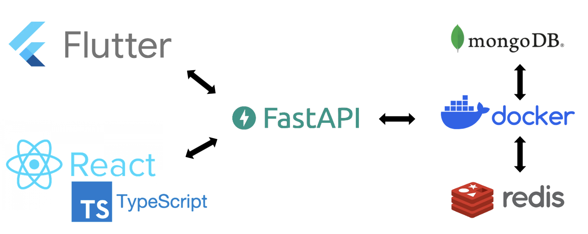

# Deep Guard 🛡️

> AI 기반 딥페이크 탐지 시스템

딥페이크 이미지를 탐지하고 분석하는 풀스택 애플리케이션입니다. Flutter 모바일 앱, React 웹 앱, FastAPI 백엔드로 구성되어 있으며, DeepfakeBench Xception 모델을 사용하여 높은 정확도의 딥페이크 탐지를 제공합니다.

**📅 Last Updated**: 2025년 12월 1일

---

## 📋 목차

- [프로젝트 구조](#-프로젝트-구조)
- [기술 스택](#-기술-스택)
- [시스템 아키텍처](#-시스템-아키텍처)
- [설치 및 실행](#-설치-및-실행)
  - [1. Backend Server](#1-backend-server-설치-및-실행)
  - [2. Web Frontend](#2-web-frontend-설치-및-실행)
  - [3. Mobile App](#3-mobile-app-설치-및-실행)
- [API 통신](#-api-통신)
- [주요 기능](#-주요-기능)

---

## 📁 프로젝트 구조

### 시스템 아키텍처 다이어그램



### 디렉토리 구조

```
deep_guard/
├── server/                     # 🔧 Backend - FastAPI 서버
│   ├── app/
│   │   ├── main.py            # FastAPI 앱 진입점
│   │   ├── api/               # REST API 엔드포인트
│   │   ├── core/              # 설정 및 의존성 관리
│   │   ├── db/                # Redis + MongoDB 관리
│   │   ├── inference/         # 딥페이크 탐지 서비스
│   │   └── models/            # DeepfakeBench Xception 모델
│   ├── docker-compose.yml     # Redis + MongoDB 컨테이너
│   ├── requirements.txt       # Python 의존성
│   └── README.md
│
├── front_web/                  # 🌐 Web Frontend - React + TypeScript
│   ├── src/
│   │   ├── pages/             # 페이지 컴포넌트
│   │   ├── components/        # 재사용 가능한 컴포넌트
│   │   ├── api/               # API 통신 로직
│   │   └── types/             # TypeScript 타입 정의
│   ├── package.json
│   └── vite.config.ts
│
└── front_mobile/               # 📱 Mobile App - Flutter
    ├── lib/
    │   ├── main.dart          # 앱 진입점
    │   ├── Screens/           # 화면 컴포넌트
    │   ├── Services/          # API 통신 서비스
    │   ├── Routers/           # 라우팅 관리
    │   └── Widgets/           # 재사용 위젯
    ├── pubspec.yaml
    └── android/ios/           # 플랫폼별 설정
```

---

## 🛠 기술 스택

### Backend
- **Framework**: FastAPI (Python 3.11+)
- **AI Model**: DeepfakeBench Xception (PyTorch)
- **Database**: Redis (캐시), MongoDB (영구 저장)
- **Visualization**: Grad-CAM (탐지 근거 시각화)
- **Container**: Docker Compose

### Web Frontend
- **Framework**: React 19 + TypeScript
- **Build Tool**: Vite
- **Styling**: Styled Components
- **HTTP Client**: Axios
- **Routing**: React Router DOM

### Mobile App
- **Framework**: Flutter 3.7+
- **Language**: Dart
- **HTTP Client**: Dio
- **State Management**: Provider (implicit)
- **Platforms**: iOS, Android

---

## 🏗 시스템 아키텍처

### 전체 구조도

```
┌─────────────────────────────────────────────────────────┐
│                     Client Layer                        │
│  ┌──────────────────┐        ┌─────────────────────┐   │
│  │  Flutter Mobile  │        │    React Web App    │   │
│  │  (iOS/Android)   │        │   (TypeScript)      │   │
│  └────────┬─────────┘        └──────────┬──────────┘   │
└───────────┼────────────────────────────┼───────────────┘
            │                            │
            │   REST API (HTTP/JSON)     │
            └────────────┬───────────────┘
                         │
┌────────────────────────▼─────────────────────────────────┐
│                  API Gateway Layer                       │
│               FastAPI Server (Port 8000)                 │
│  ┌──────────────────────────────────────────────────┐   │
│  │  POST /inference/upload                          │   │
│  │  GET  /inference/result/{task_id}                │   │
│  │  GET  /inference/statistics                      │   │
│  └──────────────────────────────────────────────────┘   │
└────────────────────────┬─────────────────────────────────┘
                         │
┌────────────────────────▼─────────────────────────────────┐
│               Business Logic Layer                       │
│  ┌─────────────────┐      ┌──────────────────────────┐  │
│  │ Detection       │      │  Database Manager        │  │
│  │ Service         │◄────►│  - Redis (Cache)         │  │
│  │                 │      │  - MongoDB (Persistent)  │  │
│  └────────┬────────┘      └──────────────────────────┘  │
│           │                                              │
│  ┌────────▼──────────────────────────────────────────┐  │
│  │  DeepfakeBench Xception Model                     │  │
│  │  - 얼굴 검출 및 크롭                               │  │
│  │  - 딥페이크 확률 계산                             │  │
│  │  - Grad-CAM 시각화                                │  │
│  └───────────────────────────────────────────────────┘  │
└──────────────────────────────────────────────────────────┘
```

### 데이터 흐름

1. **업로드**: 클라이언트 → `/inference/upload` → 파일 검증 → 모델 추론 → DB 저장 → task_id 반환
2. **결과 조회**: 클라이언트 → `/inference/result/{task_id}` → Redis 조회 → MongoDB 조회 → 결과 반환
3. **캐싱**: Redis (24시간 TTL) → MongoDB (영구 저장) → In-Memory Fallback

---

## 🚀 설치 및 실행

### 사전 요구사항

- **Backend**: Python 3.11+, Docker & Docker Compose
- **Web**: Node.js 18+, npm/yarn
- **Mobile**: Flutter SDK 3.7+, Dart SDK

---

## 1. Backend Server 설치 및 실행

## 🚀 빠른 시작

### 요구사항

- Python 3.11+
- Docker & Docker Compose (Redis + MongoDB용)
- 4GB+ RAM (AI 모델 로딩)

### 1-1단계: 설치

#### macOS / Linux

```bash
# 1. 저장소 클론
git clone https://github.com/hwnnn/deep_guard.git
cd deep_guard/server

# 2. 가상환경 생성 및 활성화
python3 -m venv .venv
source .venv/bin/activate

# 3. 의존성 설치
pip install -r requirements.txt
```

#### Windows

```powershell
# 1. 저장소 클론
git clone https://github.com/hwnnn/deep_guard.git
cd deep_guard\server

# 2. 가상환경 생성 및 활성화
py -m venv .venv
.\.venv\Scripts\activate

# 3. Windows용 dlib 설치 (필수)
# 3-1. https://github.com/z-mahmud22/Dlib_Windows_Python3.x 접속
# 3-2. 본인의 Python 버전에 맞는 .whl 파일 다운로드
#      예: Python 3.12 → dlib-19.24.99-cp312-cp312-win_amd64.whl
# 3-3. 다운로드한 파일 경로로 설치
py -m pip install "C:\Users\User\Downloads\dlib-19.24.99-cp312-cp312-win_amd64.whl"
# 3-4. requirements.txt에서 dlib==19.24.6 찾아서 주석 처리

# 4. 나머지 의존성 설치
pip install -r requirements.txt
```

> **Windows 중요**: dlib는 컴파일이 필요한 라이브러리이므로 사전 빌드된 wheel 파일을 먼저 설치해야 합니다. 위 GitHub 링크에서 본인의 Python 버전 (예: cp312 = Python 3.12)에 맞는 파일을 다운로드하세요.

### 1-2단계: 데이터베이스 실행 (선택)

```bash
# Docker Compose로 Redis + MongoDB 실행
docker compose up -d

# 확인
docker ps  # deep_guard_redis, deep_guard_mongodb 실행 중
```

> **참고**: DB 없이도 서버는 작동합니다 (in-memory fallback)

### 1-3단계: 서버 실행

```bash
# 개발 모드 (자동 재시작)
python -m uvicorn app.main:app --reload --port 8000

# 프로덕션 모드
python -m uvicorn app.main:app --host 0.0.0.0 --port 8000
```

### 1-4. 서버 확인

```bash
# Health Check
curl http://localhost:8000/health

# API 문서 (Swagger UI)
open http://localhost:8000/docs
```

**출력 예시:**
```json
{
  "status": "ok",
  "version": "1.0.0",
  "redis": "connected",
  "mongodb": "connected"
}
```

---

## 2. Web Frontend 설치 및 실행

### 2-1. 프로젝트 이동

```bash
cd front_web
```

### 2-2. 의존성 설치

```bash
# npm 사용
npm install

# yarn 사용 (선택)
yarn install
```

### 2-3. 환경 설정

`front_web/src/api/api.ts` 파일에서 백엔드 URL 확인:

```typescript
export const api = axios.create({
    baseURL: 'http://localhost:8000',  // 백엔드 서버 주소
    timeout: 60000,
});
```

### 2-4. 개발 서버 실행

```bash
# 개발 서버 시작 (포트 5173)
npm run dev

# 빌드 (프로덕션)
npm run build

# 빌드 미리보기
npm run preview
```

### 2-5. 브라우저 접속

```
http://localhost:5173
```

**주요 페이지:**
- `/` 또는 `/main`: 메인 페이지
- `/analyze`: 분석 페이지
- `/result`: 결과 페이지
- `/report`: 리포트 페이지
- `/setting`: 설정 페이지

---

## 3. Mobile App 설치 및 실행

### 3-1. 프로젝트 이동

```bash
cd front_mobile
```

### 3-2. Flutter 의존성 설치

```bash
# pub 패키지 설치
flutter pub get
```

### 3-3. 환경 변수 설정

`front_mobile/.env` 파일 생성:

```env
# Backend Server Host
HOST=localhost

# iOS 시뮬레이터: localhost
# Android 에뮬레이터: 10.0.2.2
# 실제 디바이스: 서버의 실제 IP 주소 (예: 192.168.0.10)
```

**중요**: Android 에뮬레이터에서는 `HOST=10.0.2.2`로 설정해야 합니다.

### 3-4. 디바이스 확인

```bash
# 연결된 디바이스 목록 확인
flutter devices
```

### 3-5. 앱 실행

```bash
# 자동으로 연결된 디바이스에 실행
flutter run

# 특정 디바이스 지정
flutter run -d <device_id>

# iOS 시뮬레이터
flutter run -d iPhone

# Android 에뮬레이터
flutter run -d emulator-5554

# 릴리즈 빌드
flutter run --release
```

### 3-6. 플랫폼별 빌드

**iOS (macOS에서만):**
```bash
cd ios
pod install
cd ..
flutter build ios
```

**Android:**
```bash
flutter build apk           # APK 파일 생성
flutter build appbundle     # AAB 파일 생성 (Google Play)
```

---

## 🔌 API 통신

Deep Guard는 REST API를 통해 클라이언트와 서버 간 통신을 수행합니다.

### API 엔드포인트

| Method | Endpoint | 설명 | 응답 시간 |
|--------|----------|------|-----------|
| `GET` | `/health` | 헬스체크 + DB 상태 | ~10ms |
| `POST` | `/inference/upload` | 이미지 업로드 및 딥페이크 탐지 | ~300-500ms |
| `GET` | `/inference/result/{task_id}` | 탐지 결과 조회 (캐시 우선) | ~10-50ms |
| `GET` | `/inference/statistics` | 전체 통계 조회 | ~50ms |

---

## ✨ 주요 기능

### 1. 딥페이크 탐지
- **DeepfakeBench Xception 모델**: 최신 딥러닝 기반 탐지
- **Grad-CAM 시각화**: 탐지 근거를 히트맵으로 표시
- **신뢰도 점수**: 0~1 사이의 확률값 제공
- **얼굴 자동 검출**: 이미지에서 얼굴 영역 자동 추출

### 2. 하이브리드 스토리지
- **Redis 캐시**: 최근 조회 결과 24시간 캐싱 (~10ms 응답)
- **MongoDB 저장소**: 모든 분석 결과 영구 저장
- **Fallback 메커니즘**: DB 장애 시에도 서비스 지속

### 3. 멀티 플랫폼 지원
- **웹**: 데스크톱 브라우저 최적화 (Chrome, Safari, Firefox)
- **모바일**: iOS 및 Android 네이티브 앱
- **반응형 디자인**: 다양한 화면 크기 지원

### 4. 실시간 분석
- **비동기 처리**: task_id 기반 비동기 추론
- **진행 상태**: 업로드 → 분석 중 → 완료 단계별 UI
- **즉시 응답**: 파일 업로드 후 즉시 task_id 반환

---

## 📝 라이선스

MIT License